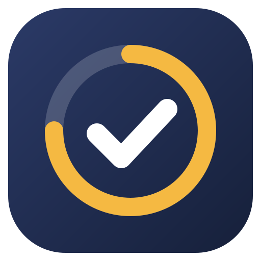

<p align="center">
  
</p>

<h1 align="center">Canvasist</h1>

<p align="center">Never miss a Canvas or Gradescope deadline again.</p>

Canvasist is a small, open-source Windows app that gathers every assignment from **Canvas** and **Gradescope** into one minimal list, shows each deadline with its submission status, and reminds you before anything is due. It lives quietly in the system tray and uses almost no resources while it waits.

Gradescope assignments usually don't appear in Canvas's assignment list, so checking Canvas alone makes it easy to miss work. Canvasist reads both and merges duplicates.

## Features

- **One list for Canvas and Gradescope**, grouped by Overdue, Today, Tomorrow, Next 7 days and Later
- **Clear status**: not submitted, submitted, late, graded, missing, excused
- **Urgency at a glance**: work due within 24 hours turns red with a live countdown; overdue work turns grey
- **Completed and dismissed work folds away** at the bottom of the list
- **Desktop reminders** before each deadline (24 hours and 3 hours by default, configurable), plus one before a Gradescope late deadline; reminders missed while the computer slept are caught up
- **Mark as done** (e.g. paper submissions, with a confirmation) and **dismiss** overdue work you won't submit; both are undoable and stay on your computer
- **Hide courses** you don't care about
- **Works with most schools**: find your school by name or enter its Canvas address, then sign in on your school's own page (SSO and multi-factor authentication work as usual). No access token needed.
- **English and Simplified Chinese**, following your system language
- **Tiny footprint**: about 2–5 MB of memory and no CPU while in the tray

## Install

Requires Windows 10 or 11.

1. Download `Canvasist_x.y.z_x64-setup.exe` from the [Releases](../../releases/latest) page.
2. Run it. The installer is not code-signed yet, so Windows SmartScreen may show "Windows protected your PC". Click **More info**, then **Run anyway**.
3. Canvasist installs for your user account only (no administrator rights needed) and starts automatically when you sign in to Windows. You can turn that off in Settings.

## Getting started

1. Open Canvasist and search for your school, or enter your Canvas address (for example `canvas.yourschool.edu`).
2. A sign-in window shows your school's own login page. Sign in as usual; the window closes by itself.
3. Your assignments appear. Gradescope connects automatically through Canvas a few seconds later; there's nothing extra to sign in to.

When your school's Canvas session eventually expires, Canvasist shows a notification and a "Sign in again" button.

## How it works

- **Sign-in**: a dedicated window loads your school's Canvas login page. Canvasist never sees your password; after you sign in, it copies the resulting session cookies and closes the window. The window has its own browser storage and cannot call any Canvasist functions.
- **Canvas**: assignments and submission status come from the Canvas REST API, using that session.
- **Gradescope**: Gradescope has no public API. Canvasist opens your course's Gradescope tab in an invisible window, exactly as you would in a browser, keeps the Gradescope session that results, and then reads your course pages.
- **Background**: while the window is closed, a single lightweight task refreshes hourly (and right after the computer wakes) and checks reminders. No browser runs in the background.

## Privacy and security

Canvasist runs entirely on your computer. There is no Canvasist server, account, telemetry or analytics.

- Your session, cached assignments, reminder history and the assignments you mark or dismiss are encrypted with Windows DPAPI, so only your Windows account can read them.
- Session cookies are only ever sent to your own Canvas site and to Gradescope.
- School search sends the name you type to Instructure's public school directory (the same one the official Canvas apps use). Entering your Canvas address directly skips this.
- Logs never contain credentials, cookies, course names, assignment titles or grades.
- Signing out deletes everything Canvasist stored, including the sign-in window's browser data.
- The app's own window loads only bundled code under a strict Content Security Policy, and every internal command must be explicitly granted to it.

Found a security problem? Please see [SECURITY.md](SECURITY.md).

## Limitations

- Windows only for now.
- Gradescope support relies on Gradescope's web pages and on your school launching Gradescope from Canvas. If Gradescope changes its pages, an update may be needed.
- Only the current term is shown.

## Development

**Prerequisites (Windows):** Node.js 24+, the Rust stable toolchain (MSVC), Visual Studio C++ Build Tools, and WebView2 (preinstalled on Windows 11).

```sh
npm ci                 # install frontend dependencies (install scripts are disabled by .npmrc)
npm run tauri dev      # run the app with hot reload
npm run tauri build    # build the release app and installer
```

Checks run in CI on every pull request:

```sh
npm run typecheck && npm run lint && npm run format:check && npm test
cd src-tauri && cargo fmt --check && cargo clippy --all-targets -- -D warnings && cargo test
```

Tech stack: [Tauri 2](https://tauri.app) (Rust) with a React + TypeScript frontend.

## License

[MIT](LICENSE)
